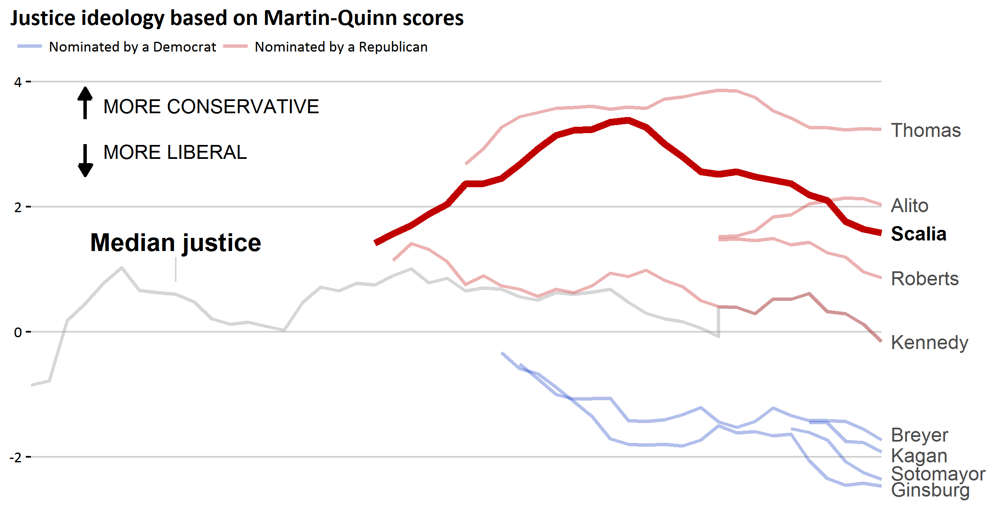

## Reproducing NY Upshot chart with R and ggplot2
This repository contains data + R code to reproduce a [chart](http://beforeitsnews.com/awesome-time-wasters/2016/02/great-dataviz-design-justice-scalias-ideology-2461610.html) from the [NYT Upshot](http://www.nytimes.com/upshot/) showing the evolution of Justice ideology over time. Original article can be found 

[Link to original data sets](http://mqscores.berkeley.edu/measures.php)